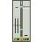

#  SHARP X68000 Emulator 'eCZ-600'

#### Copyright(C) Common Source Code Project, Sasaji 2011-2024 All Rights Reserved.

------------------------------------------------------------------------------

### This is an emulator that behaves like Sharp X68000.

### このソフトは、シャープX68000のような動きをするエミュレータです。

### [Downloads ダウンロード](https://github.com/bml3mk5/eCZ-600/releases)

### [Documents(Japanese) ドキュメント](../../tree/master/src/docs)

## Disclaimer 免責事項

* This is the free software. I have not abandoned the copyright.
  I'm Sasaji have the copyright of executable modules.
  And each author which created the source code also have the copyright.
* このソフトはフリーウェアです。ただし、著作権は放棄しておりません。
  実行モジュールについては作者Sasajiにあります。
  ソースコードについてはそれぞれの作者にあります。

* We are not responsible for any damage caused by this software.
  Please use this software at your own risk.
* このソフトによって発生したいかなる損害についても著作権者は一切責任を負いません。
  このソフトを使用するにあたってはすべて自己責任で行ってください。

* You do not need my permission to reprint this software.
  I would like you to contact me to that effect.
* 雑誌やネットなどに転載される場合、不特定多数の方に再配布を行う場合でも
  承諾の必要はありませんが、転載の旨をご連絡いただけたら幸いです。

------------------------------------------------------------------------------

  Sasaji (sasaji@s-sasaji.ddo.jp)

  http://s-sasaji.ddo.jp/bml3mk5/

  (X(Twitter): http://twitter.com/bml3mk5)

------------------------------------------------------------------------------

